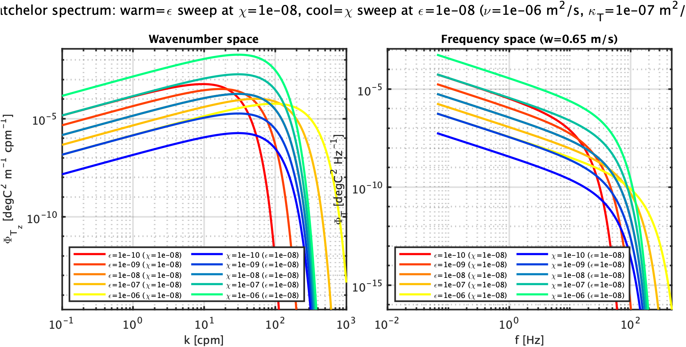
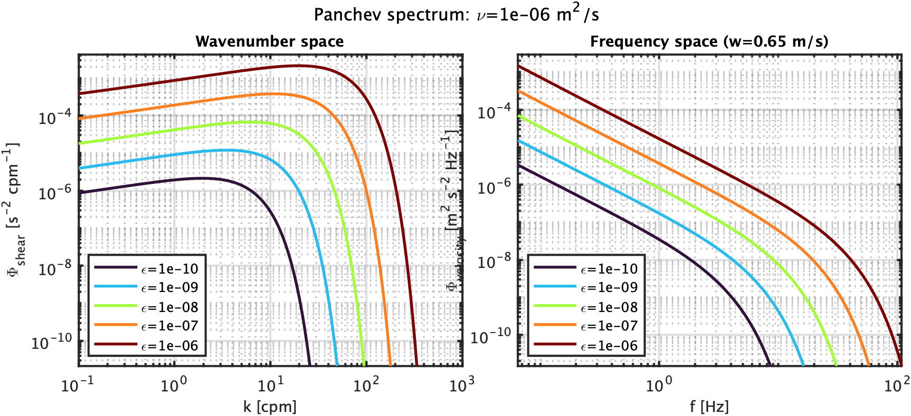

# From raw volts to a trustworthy wavenumber spectrum

`t1_volt` and `s1_volt` never look like a Batchelor or Panchev curve straight out of the ADC. Getting from a raw voltage spectrum to something you can compare against theory takes three separate steps, in this order: calibrate to physical units, deconvolve the sensor and electronics response, then relabel the frequency axis as a wavenumber axis. This page works through each step and what breaks if you skip or misorder one of them.

## 1. The ideal shape lives in wavenumber space

`toolbox/theoretical_spectra/batchelor_spectrum.m` and `toolbox/theoretical_spectra/panchev_spectrum.m` (temperature-gradient and shear respectively; `nasmyth_spectrum.m` is the shear model actually used for MLE fitting - see `docs/workflow/L2_calc_eps.md`) both take a wavenumber vector `k` **in cpm**, not frequency, and not rad/m:

```
Psg = batchelor_spectrum(epsilon, chi, nu, ktemp, k)   % [degC^2 m^-1 cpm^-1]
Pxx = panchev_spectrum(epsilon, kvis, k)                % [s^-2 cpm^-1]
```

Both are evaluated at a caller-supplied `k` rather than generating their own grid, specifically so they can be overlaid directly on an observed scan's own wavenumber bins with no interpolation (see each function's own PROVENANCE section for why).

For Batchelor, `epsilon`/`nu`/`ktemp` set the Batchelor wavenumber `kb = (epsilon/nu/ktemp^2)^(1/4)`, which is all that controls the rolloff's location; `chi` is a pure multiplicative amplitude on that shape and doesn't move the rolloff at all. For Panchev (and Nasmyth), `epsilon` sets both the level and the rolloff - there's no separate amplitude parameter.





Both figures generated by `plots/MODplot_theory_spectra_demo.m` (illustrative parameters only - not real data), at a fixed fall speed of 0.65 m/s (`epsi_mako`'s ASTRAL median, see `docs/concepts/spectral_windowing.md`). Higher epsilon shifts the rolloff to higher k (more turbulent energy cascades further down toward the Kolmogorov/Batchelor scale before dissipating) - exactly the mechanism `mod_scan_calc_epsilon_mle.m`/`mod_scan_calc_chi_mle.m` exploit to fit epsilon/chi from where a real spectrum's rolloff actually sits. The Batchelor figure's two overlaid families make the amplitude-vs-shape split above visually concrete rather than just asserted: the cool (chi-sweep) curves all peak at the identical k (checked by hand: 30.243 cpm for every value in the default chi sweep, since kb doesn't depend on chi), while the warm (epsilon-sweep) curves' peaks visibly walk to higher k as epsilon increases. Panchev has no such second family - epsilon alone sets both level and rolloff there, so there's no fixed-shape amplitude parameter to sweep separately.

## 2. Relabeling the same curve onto a frequency axis

The right-hand panel above is the *same physics*, just walked through Taylor's frozen-turbulence hypothesis (`k = f / abs(w)`) and the PSD Jacobian this codebase already uses in the forward direction - `mod_scan_fpo7_volts_to_Tg_spectrum.m` step 3 and `mod_scan_shear_volts_to_shear_spectrum.m` step 3:

```
X_k(k) = (2*pi*k)^2 * X_f(f) * abs(w),   k = f / abs(w)
```

`MODplot_theory_spectra_demo.m` solves this for `X_f` given `X_k`, since `batchelor_spectrum.m`/`panchev_spectrum.m` only ever produce the wavenumber-domain quantity directly:

```
Pt_T_f        = Psg_k         ./ ((2*pi*k).^2 * abs(w))   % temperature spectrum [degC^2 Hz^-1]
Ps_velocity_f = Pxx_k         ./ ((2*pi*k).^2 * abs(w))   % velocity spectrum   [m^2 s^-2 Hz^-1]
```

These are exactly the quantities the real processing chain computes as an *intermediate* step, before its own forward Jacobian converts them to `Pt_Tg_k`/`Ps_shear_k` - so the right-hand panels above are literally "what `Pt_T_f`/`Ps_velocity_f` should look like" once everything upstream of them has been done correctly. Note the frequency axis's rolloff location depends on fall speed (`k=f/w`); the wavenumber axis's does not.

## 3. Why the raw volts spectrum doesn't look like this yet

A raw `t1_volt`/`s1_volt` spectrum sits one calibration and one deconvolution short of `Pt_T_f`/`Ps_velocity_f`:

```
Pt_T_f = Pt_volt_f * volts_to_C(1)^2            % calibration: volts -> degC (FP07)
Pt_T_f = Pt_T_f ./ (electronics_filter .* H_thermal)   % deconvolution
```

```
Ps_velocity_f = (2*g/(Sv*abs(w)))^2 * Ps_volt_f ./ (electronics_filter .* H_oakey)   % calibration + deconvolution (shear)
```

`electronics_filter` (`setup/MODsetup_define_filters.m`, built once per deployment) is the AFE/ADC's own fixed response - a sinc^4 anti-alias filter (`processing/scans/mod_scan_adc_filter.m`) for every channel, times a bench-measured charge-amp response for shear specifically. `H_thermal`/`H_oakey` (`mod_scan_fpo7_transfer_function.m`/`mod_scan_shear_transfer_function.m`) are the probe's own dynamic response - a single-pole low-pass, fall-speed-scaled in time for the FP07 bead's thermal inertia, fixed in space for the shear probe's Oakey (1982) response. Both are magnitude-squared transfer functions, so dividing them out (not subtracting, not inverse-filtering with regularization - literal division) is what "deconvolution" means everywhere in this codebase (`mod_scan_fpo7_volts_to_Tg_spectrum.m`, `mod_scan_shear_volts_to_shear_spectrum.m`, `docs/workflow/L2_calc_chi.md` §2's "time-constant deconvolution").

Skip this step and a raw spectrum rolls off *too early* (the sensor and electronics are both attenuating high-frequency content the water actually has) - it will underestimate chi/epsilon, and doing so will look deceptively like a real, physical dissipation-scale rolloff rather than an instrument artifact, because the shape is qualitatively similar. This is exactly why `docs/workflow/L2_calc_chi.md` calls the electronics term "not negligible" - by f~62 Hz at a typical fall speed it's already a ~1.65x correction on top of the thermal rolloff, right where chi's integration is most sensitive.

## 4. Where the noise floor comes in

Once deconvolved and converted to wavenumber space, a real spectrum traces the Batchelor/Nasmyth/Panchev shape only until it drops into the sensor's own noise - past that point there's no more real signal to fit against, deconvolved or not (dividing noise by a rolling-off `H_total` actually *amplifies* it at high frequency, which is exactly why the cutoff matters so much).

Two noise floors exist side by side:

- **Bench (production path)** - `mod_scan_fpo7_bench_noise_f.m`, a cubic log-log polynomial fit to an actual bench measurement (probe disconnected, same electronics chain) from `MOD_fish_calibrations`. Rescaled to each scan's own high-frequency level via `mod_scan_fpo7_noise_adjust.m` before comparison.
- **Modeled (exploratory)** - `mod_scan_fpo7_modeled_noise_f.m`, a physics-based Johnson/thermal + amplifier noise model, multiplied only by `electronics_filter` (not `H_thermal`) since electrical noise enters downstream of the bead's thermal inertia and never passes through it. Available as an overlay in `MODvis_spectra.m`; not yet wired into production cutoff-finding.

The cutoff itself (`mod_scan_fpo7_cutoff.m` / `mod_scan_fpo7_cutoff_search.m`) is the last frequency bin where the (smoothed) spectrum stays above `SN_min=3` times whichever noise floor is in use, additionally capped at a known electrical-contamination tone (`contam_freq_hz`, deployment-specific - e.g. ~59 Hz on ASTRAL) so a persistent tone can't hold the spectrum artificially above the noise floor and pull the cutoff higher than the data actually supports. `mod_scan_calc_epsilon_obs.m`/`mod_scan_calc_chi_obs.m`'s direct integration and the MLE fits both restrict themselves to `k < kc = fc/abs(w)`.

## Reference table

| Step | Function | Domain in -> out |
|---|---|---|
| Ideal model shape | `batchelor_spectrum.m`, `panchev_spectrum.m`, `nasmyth_spectrum.m` | wavenumber -> wavenumber (model only, no volts involved) |
| Calibration | `mod_scan_fpo7_volts_to_Tg_spectrum.m` step 1, `mod_scan_shear_volts_to_shear_spectrum.m` step 2 | volts -> physical units, still frequency domain |
| Probe dynamic response | `mod_scan_fpo7_transfer_function.m`, `mod_scan_shear_transfer_function.m` | (used inside deconvolution, frequency domain) |
| Electronics/ADC response | `MODsetup_define_filters.m`, `mod_scan_adc_filter.m` | (used inside deconvolution, frequency domain, deployment-constant) |
| Deconvolution | `mod_scan_fpo7_volts_to_Tg_spectrum.m` step 2, `mod_scan_shear_volts_to_shear_spectrum.m` step 1 | frequency -> frequency, sensor/electronics response divided out |
| Frequency -> wavenumber | `mod_scan_fpo7_volts_to_Tg_spectrum.m` step 3, `mod_scan_shear_volts_to_shear_spectrum.m` step 3 | frequency -> wavenumber (Taylor's hypothesis + PSD Jacobian) |
| Noise floor | `mod_scan_fpo7_bench_noise_f.m` (+`mod_scan_fpo7_noise_adjust.m`), `mod_scan_fpo7_modeled_noise_f.m` | frequency domain, compared against the deconvolved-but-not-yet-wavenumber spectrum |
| Cutoff | `mod_scan_fpo7_cutoff.m`, `mod_scan_fpo7_cutoff_search.m` | picks `fc` -> `kc = fc/abs(w)` |

For the full narrated, step-numbered walkthrough of this same chain against real data (including the actual ASTRAL contamination-frequency investigation), see `docs/workflow/L2_calc_chi.md` (temperature/chi) and `docs/workflow/L2_calc_eps.md` (shear/epsilon) - this page is their concept-level companion, covering the physics/math background those pages assume.

## Worked example: two real scans, low and high chi

Sections 1-3 above are all assertions about shape. Here's the actual arithmetic, applied to two real FP07 scans from the same ASTRAL profile and channel (t1) - one with chi near 1e-9, one near 1e-7 - so each step's effect is visible directly rather than taken on faith.


Generated by `plots/MODplot_chi_deconvolution_steps.m` against real ASTRAL data (`Profile025.mat`, external to this repo - see the function's own EXAMPLE block for the exact loading snippet): scan 37 (chi=9.96e-10, epsilon=3.16e-09 W/kg, w=0.650 m/s) and scan 50 (chi=8.43e-08, epsilon=1.08e-08 W/kg, w=0.680 m/s). Panel 5's output is checked to match `mod_scan_fpo7_volts_to_Tg_spectrum.m`'s own `Pt_T_f` for the same inputs to floating-point precision (3.9e-16 relative) - splitting its single combined division into two visible steps here doesn't change the math.

A few things worth noticing in the real data that the pure-theory figures above can't show:

- Panel 1's real spectra sit *above* their own faint decade-bracket curves at high frequency rather than continuing to fall - that's the sensor's own noise floor (not drawn here - see Section 4 above), not a failure of the model.
- Panel 4's thermal-lag filter is nearly identical for both scans despite their different `w` (0.650 vs 0.680 m/s) - the tau0 used here (0.0083 s) is this specific deployment's own calibrated value, not this repo's registry default (0.005 s, `MODsetup_metadata_field_registry.m`) - a reminder that `time_constant_s` is a real per-deployment calibration constant, not a universal one.
- Panel 6's Batchelor fits track each scan's observed spectrum reasonably well at low k, then the observed spectra flatten out (noise) while the model curves keep rolling off - exactly the divergence a cutoff `kc` (Section 4) exists to catch, even though no cutoff is drawn or applied in this figure (out of scope here - it only shows the deconvolution chain, not the fitting/cutoff step).
