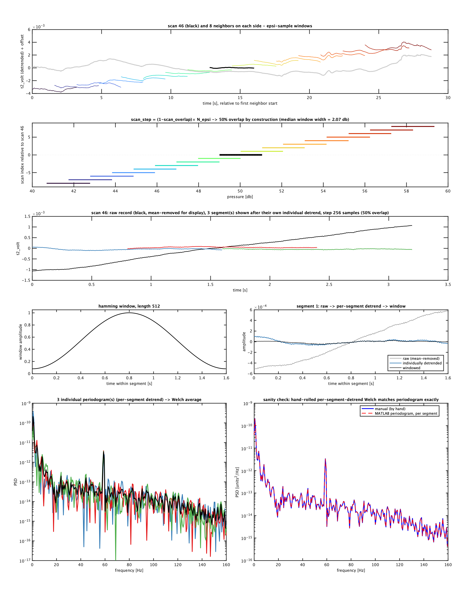
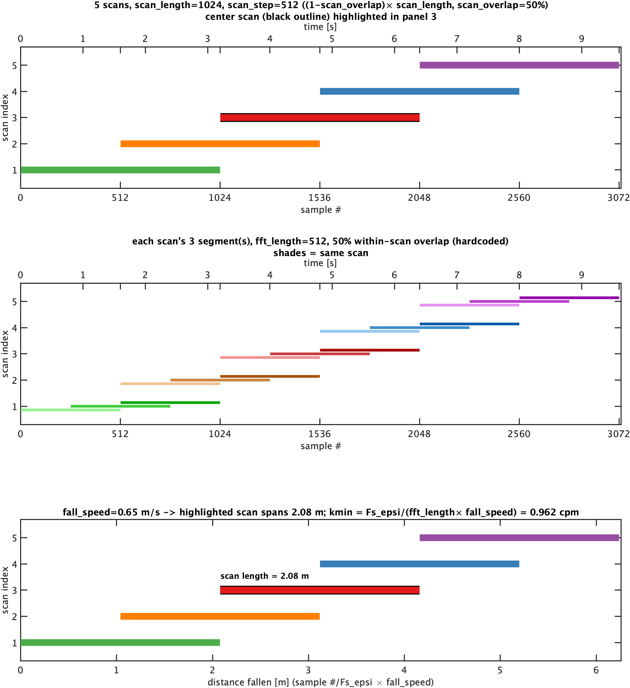
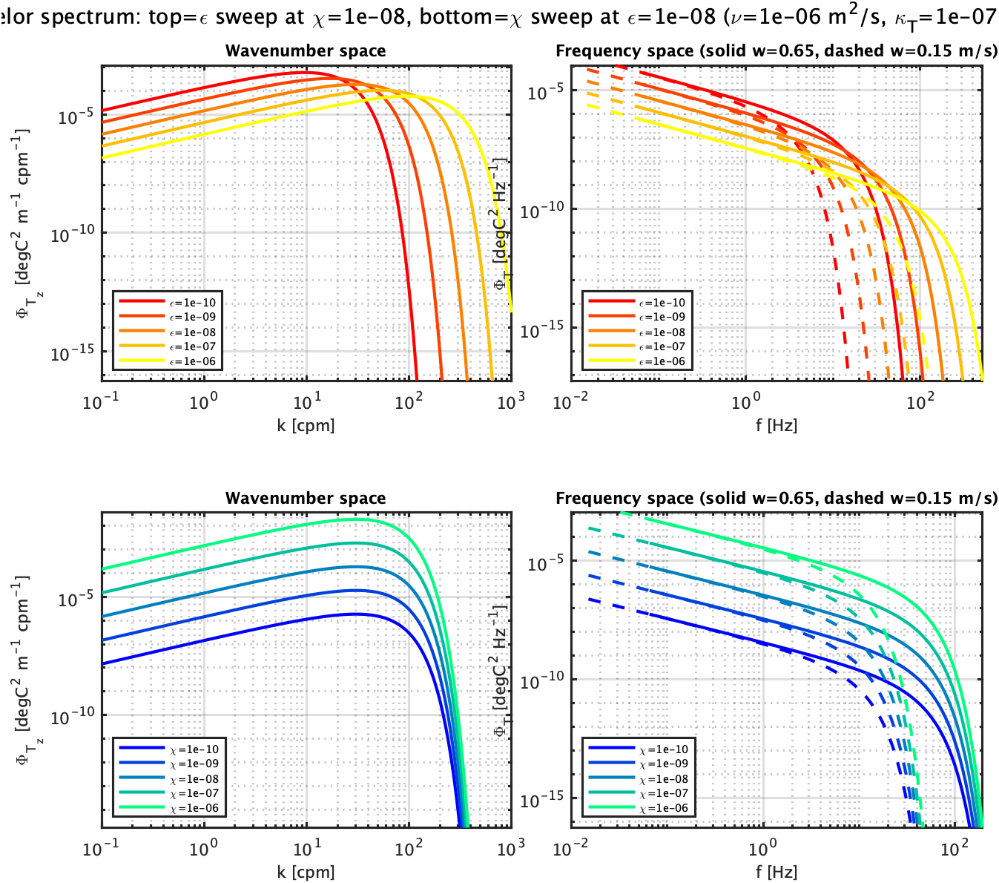
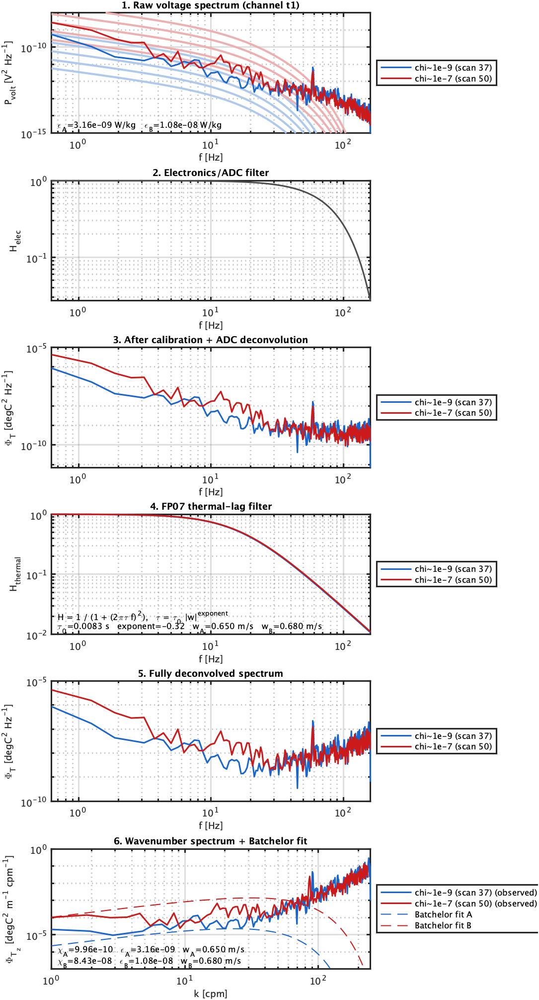
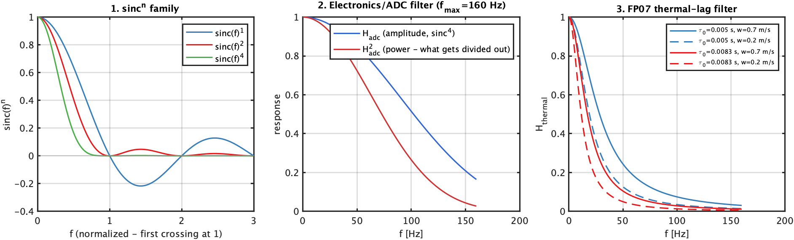

# Plots and Visualization

Catalog of the plotting tools in this repo: the interactive apps in `visualization/` and the
one-shot diagnostic figures in `plots/`. As opposed to [Concepts](../concepts/index.md) (physics
background) and [Workflow](../workflow/modraw_to_L0_conversion.md) (what each processing step
does), this section is about the plotting/exploration tools themselves - what each one shows and
how to call it.

**Convention:** every time a `MODvis_*`/`*App` or `MODplot_*` script is added or changed, add or
update its entry below with an example image and a short usage note (see `PLAN.md`, Section 11).

## Interactive apps (`visualization/`)

### MODvis_timeseries.m

Browse a folder of `.mat` files (L0, L1, L2, or `Profile*`) and plot up to 6 rows of any field
that carries a `dnum` timestamp - each row optionally split across a left/right `yyaxis` pair.
Supports nested fields (`epsi.channel1`, `ctd.P_raw`, `gps.latitude`, ...). Formerly
`L0ExplorerApp.m`.

```matlab
app = MODvis_timeseries();                 % opens a folder chooser
app = MODvis_timeseries('/path/to/L0');    % or point it at a folder directly
```

*No example screenshot committed yet.*

### MODvis_spectra.m

Browse a folder of `.mat` files carrying per-scan spectra - either this repo's own L2/profile
output or a legacy `MOD_fish_lib`/EPSILOMETER `Profile*.mat`. Shows pressure and up to 2 raw
channels per row for context, and plots the full 7-channel raw spectrum for any scan you click.

```matlab
app = MODvis_spectra();
app = MODvis_spectra('/path/to/profiles');
```

*No example screenshot committed yet.*

### MODvis_twist_timeseries.m

Plots cable twist count (gyro method) vs. time for a deployment, highlighting upcast samples
(when the fin is normally adjusted) and marking spool-swap events.

```matlab
ax = MODvis_twist_timeseries(TwistTimeseries);   % TwistTimeseries from
                                                   % MODprocess_L1_accumulate_twist_timeseries.m
```

*No example image committed yet.*

### SpectraExplorerApp.m

Browse `Profile*.mat` files and step through depths, viewing t1/t2 temperature-gradient spectra
and chi side by side with the QC diagnostics used to judge whether a chi value is trustworthy
(cutoff/kmin wavenumbers, modeled vs. observed noise, raw/noise-subtracted/MLE chi comparison).

```matlab
app = SpectraExplorerApp();                    % opens a folder chooser
app = SpectraExplorerApp('/path/to/profiles');
```

Full panel-by-panel reference: [SpectraExplorerApp: Chi Inspector manual](CHI_INSPECTOR_MANUAL.md).

*No example screenshot committed yet.*

## Diagnostic plots (`plots/`)

### MODplot_scan_context.m

One L1 file, one scan: shows how that scan's window overlaps its neighbors, and how
`mod_scan_get_spectra.m` segments/detrends/windows/averages within it (checked against MATLAB's
own `periodogram` as a sanity check).

```matlab
fig = MODplot_scan_context(data, metadata, target_pressure, channel);
```

{: style="max-width: 800px;" }

### MODplot_scans_and_segments.m

Purely theoretical companion to `MODplot_scan_context.m`: no L1 file needed, just
`fft_length`/`scan_length`/`fall_speed`, for exploring a candidate windowing combination before
committing it to `setup.yml`.

```matlab
fig = MODplot_scans_and_segments(fft_length, scan_length, fall_speed);
```



See [Choosing fft_length, fft_segments_per_scan, and scan_overlap](../concepts/spectral_windowing.md)
for the full writeup this figure supports.

### MODplot_chi_spectra_noise_floor.m

One scan's FPO7/chi noise-floor diagnostic: wavenumber spectrum on top, frequency-space
precursor below, each against 3x the noise floor for three noise models (unadjusted, adjusted,
theoretical), plus each model's own cutoff and resulting Batchelor fit.

```matlab
fig = MODplot_chi_spectra_noise_floor(spec);
```

*No example image committed yet.*

### MODplot_profile_spectra_summary.m

Whole-profile diagnostic: fall speed, epsilon, and chi profiles over a pressure range, with 4
representative scans picked out and each one's epsilon/chi spectrum shown against a theoretical
Panchev/Batchelor curve built from that scan's own fitted values.

```matlab
fig = MODplot_profile_spectra_summary(data, pressure_range);
```

*No example image committed yet.*

### MODplot_theory_spectra_demo.m

Purely theoretical: draws the Batchelor and Panchev model spectra on both their native
wavenumber axis and a frequency axis (via Taylor's frozen-turbulence hypothesis), with no real
data - "what a fully deconvolved spectrum should look like" before it meets a noise floor.

```matlab
[figBatchelor, figPanchev] = MODplot_theory_spectra_demo();
```



See [From raw volts to a trustworthy wavenumber spectrum](../concepts/spectral_filtering_and_noise_floors.md)
for the full writeup (both this figure and the Panchev counterpart).

### MODplot_chi_deconvolution_steps.m

Real-data companion to `MODplot_theory_spectra_demo.m`: takes two real FP07 scans (meant to be
one low-chi, one high-chi example) and shows the actual pipeline arithmetic - calibration, ADC
deconvolution, thermal-lag deconvolution, Jacobian to wavenumber space - one panel per step.

```matlab
fig = MODplot_chi_deconvolution_steps(scanA, scanB, metadata, channel);
```



Same doc as above has the full panel-by-panel walkthrough with the real scan numbers/chi/epsilon
values used.

### MODplot_fpo7_filters_explained.m

Purely illustrative, no real data: what the electronics/ADC filter and the FP07 thermal-lag
filter actually look like, and why - a generic sinc^n family, the real sinc^4 electronics
filter (amplitude vs. squared power), and the thermal-lag filter across two time constants and
two fall speeds (both a longer tau and a slower fall speed steepen it).

```matlab
fig = MODplot_fpo7_filters_explained();
```



See [From t1_volt to chi: a worked walkthrough](../concepts/temperature_to_chi_walkthrough.md)
for the full writeup.
