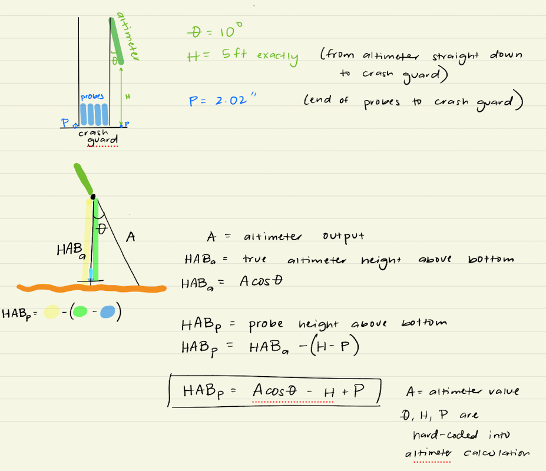

# L0 → L1: Converting raw counts to physical units

**Status:** working, tested against real deployment files. Second step of the `MOD_fish_lib` → `MOD_fish_processing` reorganization (see `PLAN.md` at the repo root). Built on branch `l0_to_l1_conversion`.

## What this step does

Takes an L0 `.mat` file (raw counts/hex, no calibrations - see [L0: converting .modraw to .mat](L0_modraw_conversion.md)) and converts it to physical units:

- **epsi** - AFE channel counts → volts (thermistor/shear channels) or g (accelerometer channels)
- **ctd** - raw hex → pressure [dbar], temperature [°C], conductivity [S/m], salinity [psu], plus derived potential temperature, potential density, `dP/dt`, depth, `dz/dt`
- **alt**, **isap** - raw distance → height above bottom (`hab`)

Every other field (`gps`, `vnav`, `seg`, `spec`, `avgspec`, `dissrate`, `apf`, `fluor`, `ttv`) passes through unchanged.

Doing this requires a deployment configuration - which physical sensor is on which AFE channel, what its full-scale voltage range is, which CTD calibration coefficients apply - so this is also where a `setup.yml` file first enters the pipeline (see PLAN.md Section 2 for the metadata design).

Explicitly **not** done at this step (still open - see PLAN.md Section 6.2 and Section 7):
- `MODsetup_read_yaml.m` looks up each shear probe's `Sv` into `metadata.AFE.(channel).cal`, but nothing yet *applies* it - shear channels stay as volts, not `1/s`. The physical-unit conversion (`Sv × volts / fall_speed`) needs a fall speed, normally `ctd.dzdt` - not resolved yet for deployments with no CTD
- No FPO7 `dTdV` calibration at all yet - it isn't a lookup value like `Sv` (see the `AFE.(channel).cal` row above), it has to be fit in-situ per deployment against real CTD temperature
- No despiking
- No SOM instrument transfer function filters

## Functions

### `MODsetup_read_yaml.m`

```matlab
metadata = MODsetup_read_yaml(setup_yml)
```

Reads a deployment's `setup.yml` and returns a `metadata` struct:

| Field | Contents |
|---|---|
| `paths.data_root`, `.raw`, `.L0`, `.L1`, `.meta`, `.calibrations_root` | Derived fresh from `setup.yml`'s `data_root` field - **never saved to disk**, since paths are machine-specific |
| `fish_flag` | `'FCTD'` or `'EPSI'` - selects which `altimeter` geometry block in the yaml applies |
| `manifest.has_vnav`, `.has_isap`, `.has_alt`, `.has_gps`, `.has_fluor` | Presence flags from `setup.yml`'s `instrument_manifest` block. `false` when the key is missing entirely, same as an explicit `false`. Not consumed by L0→L1 today (those fields just pass through from L0 unchanged) - a record of what's on the vehicle for later steps |
| `PROCESS.latitude` | Used for `ctd.z` (depth from pressure) when a file has no GPS fix |
| `PROCESS.channels` | AFE sensor names in ADC slot order, e.g. `{'t1','t2','s1','s2','a1','a2','a3'}` - order comes from `instrument_manifest.afe.channel_N` keys, sorted numerically by `N` (not from yaml field order) |
| `AFE.(channel).full_range`, `.ADCconf` | Per channel, from `setup.yml`'s `afe.channels` detail block (keyed by sensor name) |
| `AFE.(channel).type` | From `setup.yml`'s `instrument_manifest.afe.channel_N.type` |
| `AFE.(channel).SN` | Only set when the manifest's `channel_N.sn` is present and non-empty |
| `AFE.(channel).cal` | Only set for `shear` type channels with an `SN` - `Sv`, the most recent row of `calibrations_root/SHEAR_PROBES/<SN>/Calibration_<SN>.txt`. `[]` if that file doesn't exist yet. **Not set at all for `fpo7`** - `dTdV` isn't a fixed property of the probe you can look up; it's fit in-situ per deployment against real CTD temperature data (`mod_epsi_linear_calibration_FP07.m`'s `polyfit(volts, T, 1)`), which is a later L1 step's job, not something a static file can answer |
| `CTD.name`, `.sample_per_record` | Only set when `setup.yml` has a `ctd:` block - deployments with no CTD don't need one |
| `CTD.SN`, `.cal` | Only set when `instrument_manifest.ctd.sn` is present and non-empty. `.cal` is SBE calibration coefficients, read from `calibrations_root/SBE/<SN>.CAL` (the `MOD_fish_calibrations` repo) |
| `GEOMETRY.alt_angle_deg`, `.alt_dist_from_crashguard_ft`, `.alt_probe_dist_from_crashguard_in` | Only set when `setup.yml` has an `altimeter.fctd` or `altimeter.epsi` block matching `fish_flag` - deployments with no `alt`/`isap` hardware don't need one |

Also saves `metadata.mat` into `meta/` alongside `setup.yml` - a portable deployment record with `paths` stripped out, so it means the same thing on any machine. Re-derive `metadata.paths` by calling `MODsetup_read_yaml` again rather than trusting a stale `metadata.mat`.

Deliberately minimal: it only resolves the fields this L0→L1 step actually uses. It does not yet build the grouped `metadata.manifest.shear_channels`/`.fpo7_channels`-style lists from PLAN.md Section 5 - nothing downstream needs those yet. Add fields as later steps need them, not preemptively.

**`setup.yml`'s `instrument_manifest` block says what's physically on the vehicle at a glance; electrical/sampling specifics (full_range, ADCconf, sample_per_record, ...) live in separate detail sections further down, keyed by the same names the manifest declares.** An instrument entirely absent from `instrument_manifest` is treated as not on the deployment - nothing errors on a missing key, so `ctd`/`altimeter`/`isap`/`alt`/`gps` are all optional depending on what hardware the deployment actually carries. See `data_for_reorg/epsi_mako_w_fluor/25_0408_d03_mako1_canyonhead/meta/setup.yml` for a real example with a CTD, altimeter (`isap`), `vnav`, and a fluorometer:

```yaml
data_root: /path/to/deployment          # only path in the file - everything else derives from it
calibrations_root: /path/to/MOD_fish_calibrations

fish_flag: FCTD
latitude: 32.8

instrument_manifest:
  ctd:
    sn: '0674'
  afe:                                  # keyed by ADC slot - the order the SOM firmware samples in
    channel_1: {name: t1, type: fpo7}
    channel_2: {name: t2, type: fpo7}
    channel_3: {name: s1, type: shear}
    channel_4: {name: s2, type: shear}
    channel_5: {name: a1, type: acc}
    channel_6: {name: a2, type: acc}
    channel_7: {name: a3, type: acc}
  isap: true
  vnav: true
  fluor: true
  # no alt or gps hardware on this deployment - keys omitted entirely

ctd:
  type: S49
  sample_per_record: 2

afe:
  channels:                              # electrical details, keyed by sensor name
    t1: {full_range: 2.5, ADCconf: Unipolar}
    t2: {full_range: 2.5, ADCconf: Unipolar}
    s1: {full_range: 2.5, ADCconf: Bipolar}
    s2: {full_range: 2.5, ADCconf: Bipolar}
    a1: {full_range: 1.8, ADCconf: Unipolar}
    a2: {full_range: 1.8, ADCconf: Unipolar}
    a3: {full_range: 1.8, ADCconf: Unipolar}

altimeter:
  fctd:
    angle_deg: 45
    dist_from_crashguard_ft: 4
    probe_dist_from_crashguard_in: 0
```

And `data_for_reorg/epsi_deepsolo/26_0520_ljc/meta/setup.yml` for a real example with **no** CTD or altimeter hardware - just epsi with shear/fpo7 probe calibration lookup and a `vnav`:

```yaml
data_root: /path/to/deployment
calibrations_root: /path/to/MOD_fish_calibrations

fish_flag: EPSI
latitude: 32.9

instrument_manifest:
  afe:
    channel_1: {name: t1, type: fpo7,  sn: 274}
    channel_2: {name: t2, type: fpo7,  sn: 311}
    channel_3: {name: s1, type: shear, sn: 261}
    channel_4: {name: s2, type: shear, sn: 421}
    channel_5: {name: a1, type: acc}
    channel_6: {name: a2, type: acc}
    channel_7: {name: a3, type: acc}
  vnav: true
  # no ctd, isap, alt, or gps hardware on this deployment - keys omitted

afe:
  channels:
    t1: {full_range: 2.5, ADCconf: Unipolar}
    t2: {full_range: 2.5, ADCconf: Unipolar}
    s1: {full_range: 2.5, ADCconf: Bipolar}
    s2: {full_range: 2.5, ADCconf: Bipolar}
    a1: {full_range: 1.8, ADCconf: Unipolar}
    a2: {full_range: 1.8, ADCconf: Unipolar}
    a3: {full_range: 1.8, ADCconf: Unipolar}
```

`instrument_manifest.afe` is keyed by physical ADC slot (`channel_1`..`channel_7`), not by sensor name - that distinction matters because raw parsing (`MODprocess_single_modraw_to_L0.m`) only ever sees slot numbers (L0's `epsi.channel1`..`channel7`); `MODsetup_read_yaml.m` is what resolves slot → logical name (`t1`, `s1`, ...) for everything downstream. Slot order for `metadata.PROCESS.channels` comes from numerically sorting the `channel_N` keys, not from yaml field order - the old schema relied on yaml field order, which YAML libraries preserve but don't sort, so a `channel_10` would have sorted before `channel_2` under that approach the moment a deployment passed 9 channels. See PLAN.md Section 5 for the larger `metadata.manifest` idea this could still grow into (`shear_channels`/`fpo7_channels`-style grouped lists) once something actually needs to loop over "all shear channels" rather than check `metadata.AFE.(ch).type` one channel at a time - not built yet, since nothing consumes it.

MATLAB has no built-in YAML reader (checked in R2024b: no `yaml.*` namespace, `readstruct` only accepts `'json'`/`'xml'`/`'auto'` as `FileType`), so `MODsetup_read_yaml.m` uses the vendored third-party `toolbox/YAMLMatlab_0.4.3/` (MIT licensed).

### `MODprocess_single_L0_to_L1.m`

```matlab
data = MODprocess_single_L0_to_L1(L0_data, metadata)
```

Pure transformation - takes an L0 struct and a `metadata` struct, returns the same fields with `epsi`/`ctd`/`alt`/`isap` converted to physical units. No file I/O.

The three conversion steps (`convert_efe_channels`, `calibrate_ctd`, `calibrate_altimeter_hab`) live as **local subfunctions inside this file**, not as separate `modProcess_L1_apply_*.m` files - nothing calls them standalone today. Split one out the moment something else needs to call it directly.

Notes on the CTD conversion specifically:
- SBE49 "eng" format (raw hex counts) goes through the full SBE calibration polynomials (temperature, pressure, conductivity), then salinity via `sw_salt`.
- SBE41 "PTS" format arrives from L0 already as ASCII-parsed P/T/S (conductivity left `NaN`) - no calibration equations needed, only the derived fields below.
- External CTD (DeepSolo/Wirewalker - see below) arrives the same way as SBE41: already physical units, only needs the derived fields.
- `th` (potential temperature), `sgth` (potential density), `dPdt`, `z` (depth), `dzdt` are computed for all three sources, using the CSIRO `seawater` toolbox (vendored at `toolbox/seawater/`). Salinity is derived via `sw_salt` too, if the source didn't already report it.
- Depth (`z`) needs a latitude: interpolated from `data.gps.latitude` if the file has GPS fixes, otherwise falls back to `metadata.PROCESS.latitude` from `setup.yml`.

Notes on the EFE channel conversion (`convert_efe_channels`) specifically:
- Every AFE channel - thermistor (`fpo7`), shear, and accelerometer alike - arrives from L0 as the same thing: raw 24-bit ADC counts, in `epsi.channel1`..`channelN` (ADC slot order, not sensor identity - see `MODsetup_read_yaml.m`'s `PROCESS.channels` note above).
- The first thing this does is rename each slot to its logical sensor name from `setup.yml` (`metadata.PROCESS.channels`), suffixed `_count`: `epsi.channel1` → `epsi.t1_count`, `epsi.channel3` → `epsi.s1_count`, etc. This is a pure rename - `t1_count` and the old `channel1` hold identical values, just keyed by the manifest name instead of the ADC slot number. The old `channelN` field is then discarded (`rmfield`).
- From there, `t1_count` → `t1_volt` is a **linear (affine) conversion** - not spectral, not a lookup table - using each channel's `full_range` (`FR`) and `ADCconf` from `setup.yml`'s `afe.channels` block:
  - **Unipolar**: `volt = FR/gain * count / 2^24`
  - **Bipolar**: `volt = FR/gain * (count/2^23 - 1)`

  (`gain` is hardcoded to `1` today - not read from `setup.yml`.)
- Accelerometer channels (`type: acc`) get one more linear step on top of `_volt`, converting volts to g's with two hardcoded constants (accelerometer full range is always 1.8 V, centered at 0.9 V = 0 g): `epsi.a1_g = (a1_volt - 0.9) / 0.4`. Non-accelerometer channels stop at `_volt` - there's no `_g` field for `t*`/`s*`.
- Shear (`type: shear`) and FPO7 (`type: fpo7`) channels stop at `_volt` - conversion to their real physical units (`1/s` for shear, `°C` for FPO7) isn't implemented yet (see "Explicitly not done at this step" above).

#### External CTD (DeepSolo, Wirewalker)

Some vehicles' CTD data never appears as `$SB49`/`$SB41` blocks in the `.modraw`/L0 stream at all - it comes from an independent file logged separately by the CTD instrument itself. `metadata.vehicle_name` (from `setup.yml`, e.g. `DeepSolo` or `Wirewalker`) is the flag that selects this path. When it matches and `metadata.paths.ctd` (`data_root/ctd/`) exists on disk:

1. `MODprocess_all_L0_to_L1.m` calls `MODprocess_read_external_ctd.m` **once** per session (not per file) to read and normalize the whole deployment's CTD data into one struct.
2. For each L0 file, it slices that struct down to the file's own time range (by the min/max `dnum` found in the file's `epsi`/`vnav` data) and passes the chunk into `MODprocess_single_L0_to_L1` as a third, optional argument.
3. Inside `MODprocess_single_L0_to_L1`, that chunk becomes `data.ctd` (since the file's own `L0_data.ctd` is empty for these vehicles) and runs through the same derived-field path SBE41 uses.

If `data_root/ctd/` doesn't exist yet, this is treated as "no CTD for this deployment yet," not an error - the rest of L0→L1 (epsi, vnav, ...) still runs normally.

**`MODprocess_read_external_ctd.m` has no real parser implemented yet** for any specific instrument (RBR, or otherwise) - no sample file has been available to build one against. It's a stub today (errors clearly if actually called) so the plumbing above could be built and reasoned about ahead of time. Whatever instrument produces the file, its reader must normalize into:

| Field | Units | Notes |
|---|---|---|
| `dnum` | MATLAB datenum | The master clock - `time_s` and everything else timing-related is derived from this in `calibrate_ctd`, not read from the file |
| `P` | dbar | |
| `T` | °C (IPTS-68) | |
| `C` | S/m | **not** mS/cm - `calibrate_ctd`'s `ctd.C*10./c3515` ratio requires S/m to match the `c3515 = 42.914` mS/cm standard (1 S/m = 10 mS/cm) |
| `S` | psu (PSS-78) | optional - derived from `C`/`T`/`P` via `sw_salt` if not reported |

Expected sample rate is ~16 Hz, sometimes 8 Hz - not enforced by the reader, since chunking works off `dnum` spacing directly rather than an assumed rate.

`calibrate_altimeter_hab` uses the same `GEOMETRY` fields for both `alt` (the MOD altimeter) and `isap` (ISA500) - inherited as-is from the source function, which assumed the same mount geometry for both. Verified against real `isap` data and, as of `data_for_reorg/epsi_mako/blt2021_0715`, real `alt` data too.

#### Altimeter → probe height-above-bottom (`hab`) math



The altimeter sits above the crash guard, mounted at an angle from vertical (`GEOMETRY.alt_angle_deg`, θ). `GEOMETRY.alt_dist_from_crashguard_ft` (H) is the vertical distance straight down from the altimeter to the crash guard. The probes it's protecting extend down from the guard but are recessed above the guard's own bottom edge by `GEOMETRY.alt_probe_dist_from_crashguard_in` (P) - i.e. the probe tips sit *higher* than the very bottom of the guard by P.

Given the altimeter's raw slant-range reading (`alt.dst`/`isap.dst`, already in meters - call it `A`):

- True altimeter height above bottom: `HAB_a = A·cos θ`
- Crash guard's bottom edge is `H` below the altimeter, so its height above bottom is `HAB_a - H`
- The probe tips sit `P` above the guard's bottom edge, so **probe height above bottom**: `HAB_p = (HAB_a - H) + P = A·cos θ - H + P`

This is exactly what `calibrate_altimeter_hab` computes: `hab = dst.*cos(theta) - (feet2meters(H) - inches2meters(P))`, i.e. `dst*cos(theta) - H + P` once `H`/`P` are converted to meters. Confirmed against `blt2021_0715`'s real geometry (θ=10°, H=5 ft, P=2.02 in).

### `MODprocess_L1_add_twist.m` and cable twist counting

```matlab
data = MODprocess_L1_add_twist(data)
```

Called automatically inside `MODprocess_single_L0_to_L1.m` (after `calibrate_ctd`, so it has calibrated pressure to interpolate) whenever `data.vnav` is present and non-empty - a no-op (with a warning) otherwise, so deployments without a VecNav just don't get a `twist` field.

The physical problem: the instrument cable twists as it profiles. On the FastCTD a fin can be adjusted to counteract this, but the operator needs the current twist count **during** the deployment to know when and how much to adjust it. Epsi rarely twists much on its own - the cable twisting mostly comes from FastCTD - but a cruise often switches between both instruments on the same winch cable, so the twist count is tracked per file and per deployment regardless of vehicle type (gated on `metadata.manifest.has_vnav`, not on `fish_flag`).

Algorithm (ported from `MOD_fish_lib/FastCTD_MATLAB/GV_PlotUpAccumulation.m`):

1. Drop bad vnav samples (NaN/Inf/non-monotonic `dnum`).
2. Interpolate CTD pressure onto the vnav timebase (`interp1(ctd.dnum, ctd.P, vnav.dnum)`) - `NaN` if there's no CTD on this deployment. Used downstream to mark upcast/downcast on the twist plot.
3. For each sample, rotate the compass and gyro vectors into the gravity-aligned z-axis frame using `SN_RotateToZAxis` (a local subfunction inside `MODprocess_L1_add_twist.m`, written by San Nguyen - finds the Euler rotation that takes the local acceleration vector to `[0 0 |a|]`). Not split into its own file since nothing else calls it.
4. **Compass method (cross-check):** normalize the rotated horizontal compass components to a unit vector, `unwrap(angle(...))` gives the instantaneous heading in radians.
5. **Gyro method (primary):** cumulative sum of the rotated z-axis gyro rate × `dt`, divided by `2*pi` to convert radians to full rotations - the unit operators actually count fin/spool adjustments against.

`data.twist` fields: `time_s`, `dnum`, `pressure` [dbar], `count_gyro` [full rotations, primary], `count_compass` [radians, cross-check]. Count starts from ~0 for each file - `MODprocess_L1_accumulate_twist_timeseries.m` (below) handles cross-file chaining, so reprocessing one file never corrupts the accumulated deployment timeseries.

### `MODprocess_L1_accumulate_twist_timeseries.m`

```matlab
TwistTimeseries = MODprocess_L1_accumulate_twist_timeseries(L1_dir, meta_dir)
```

Called automatically at the end of `MODprocess_all_L0_to_L1.m`, gated on `metadata.manifest.has_vnav` - re-chains every L1 file's per-file `twist` field into one continuous, non-resetting rotation count for the whole deployment, sorted by file start time (each file's own count restarts at 0, so this offsets each by the running cumulative total from all prior files). Saves `meta/TwistTimeseries.mat`.

Also applies spool-swap resets from an operator-edited `meta/SpoolSwapLog.csv` (`#`-comment lines supported, columns `datetime_utc, spool_id, spool_length_m, notes`), if that file exists: at each swap timestamp, the cumulative count is reset to 0 from that point forward. `TwistTimeseries.spool_swap_dnum` records the swap times actually applied, for the plot to mark. Cruise-level tracking of spool swaps and fin-angle adjustments *across* deployments/instruments (same winch cable, different vehicles) is not built yet - `SpoolSwapLog.csv` today only resets within a single deployment's `TwistTimeseries.mat`.

L1 `.mat` files are saved as `save(L1_file, '-struct', 'data')` (flattened - `vnav`/`twist`/etc. are top-level variables, not nested under a `data` struct), so this function loads `vnav`/`twist` directly rather than `data.vnav`/`data.twist`.

### `MODvis_twist_timeseries.m`

```matlab
ax = MODvis_twist_timeseries(TwistTimeseries, ax)
```

Plots `count_gyro` vs. time, highlighting upcast samples (`diff(pressure) < 0`) and marking any spool swap events as vertical lines. "Neutral is Negative" - setting the fin to neutral makes the count go down. Not called automatically - run manually against `meta/TwistTimeseries.mat` when you want to look at the deployment picture (e.g. during a cruise, to decide when to adjust the fin).

### `MODprocess_all_L0_to_L1.m`

```matlab
L1_files = MODprocess_all_L0_to_L1(L0_dir, metadata, L1_dir, reprocess_all)
```

Orchestrator: loops over every `.mat` file in `L0_dir`, calls `MODprocess_single_L0_to_L1` on each, saves one `.mat` per L0 file into `L1_dir`. `L1_dir` is optional - defaults to a sibling `L1/` folder next to `L0_dir` (created if it doesn't exist). `metadata` should be read once per session with `MODsetup_read_yaml` and passed in, not re-read per file.

Skips a file if its L1 `.mat` already exists and is newer than the L0 file it came from - except the most recently modified L0 file, which is always reprocessed (mirrors `MODprocess_all_modraw_to_L0.m`'s same rule one level up, in case the raw file behind it was still being written when L0 last ran). Pass `reprocess_all = true` to force every file to redo regardless.

Also where the external-CTD read-once-and-slice-per-file logic lives (`slice_external_ctd`, a local subfunction) - see "External CTD (DeepSolo, Wirewalker)" above.

At the end of every call, if `metadata.manifest.has_vnav` is true, also calls `MODprocess_L1_accumulate_twist_timeseries` once to re-chain every L1 file's twist field into `meta/TwistTimeseries.mat` - see "`MODprocess_L1_accumulate_twist_timeseries.m`" above. Cheap (just concatenates fields already computed per-file), so this keeps the deployment-level twist count always current without a separate manual step.

## How to run it

```matlab
addpath('/path/to/MOD_fish_processing/processing');
addpath('/path/to/MOD_fish_processing/setup');
addpath('/path/to/MOD_fish_processing/util');      % for MODutil_short_path
addpath('/path/to/MOD_fish_processing/toolbox');   % YAMLMatlab_0.4.3, seawater

metadata = MODsetup_read_yaml('/path/to/deployment/meta/setup.yml');

% L0 must already exist - see L0_modraw_conversion.md
L1_files = MODprocess_all_L0_to_L1(metadata.paths.L0, metadata, metadata.paths.L1);
```

To process a single file directly:

```matlab
L0_data = load('/path/to/deployment/L0/EPSI25_04_08_150323.mat');
data = MODprocess_single_L0_to_L1(L0_data, metadata);
figure; plot(data.ctd.dnum, data.ctd.T);      % calibrated temperature
figure; plot(data.epsi.time_s, data.epsi.s1_volt);  % shear channel, volts
```

## Known limitations / things to check

- **The `alt.hab` path** is now verified against real data (`data_for_reorg/epsi_mako/blt2021_0715`) in addition to `isap` - both produce physically plausible `hab` values using the same math (see "Altimeter → probe height-above-bottom (`hab`) math" above).
- **`isap.dst` pegs at a flat maximum value (120, in the one deployment tested) when the target is out of range** - not a bug, but don't mistake a flatlined `isap.hab` for a real constant range to bottom.
- **Depth/salinity near zero at the start of a deployment is expected, not a bug.** The first raw file of a cast is often recorded on deck with the CTD in air - conductivity ≈ 0 gives salinity ≈ 0 via `sw_salt`, and pressure ≈ 0 gives depth ≈ 0. This resolves once the instrument is in the water.

## History

Ported from `mod_som_read_epsi_files_v4.m` in the old `MOD_fish_lib` monolith - specifically the physical-conversion half of that function (the raw-parsing half became `MODprocess_single_modraw_to_L0.m` in the L0 step). Built on branch `l0_to_l1_conversion`:

- Added `MODsetup_read_yaml.m` as the first piece of yaml-driven `metadata`, per PLAN.md Section 2 - deliberately scoped to only what this step needs, growing incrementally rather than building the full metadata schema up front.
- Vendored `YAMLMatlab_0.4.3` (no built-in MATLAB YAML reader) and the CSIRO `seawater` toolbox (for `sw_salt`/`sw_ptmp`/`sw_pden`/`sw_dpth`) into `toolbox/`.
- Fixed a latent bug found in `MODprocess_single_modraw_to_L0.m` while porting the altimeter logic: it called `orderfields(alt, {..., 'hab'})` but never set `alt.hab` - `hab` needs instrument geometry that L0 deliberately doesn't have. Would have thrown a hard error on any deployment with `alt` data; none of the four `data_for_reorg` deployments tested so far have any, so it was never hit until now. `hab` is now correctly computed here instead, for both `alt` and `isap`.
- Renamed `MODprocess_new_modraw_to_L0.m` → `MODprocess_all_modraw_to_L0.m` so the L0 and L1 batch orchestrators share the same `MODprocess_all_*` naming pattern.
- Tested against all 96 files of `epsi_mako_w_fluor/25_0408_d03_mako1_canyonhead` - see PLAN.md Session Log (2026-07-09) for full results.
- **Cable twist counting added** (2026-07-24, PLAN.md Section 7 - Ana's project): `MODprocess_L1_add_twist.m`, `MODprocess_L1_accumulate_twist_timeseries.m`, `MODvis_twist_timeseries.m`, ported from `MOD_fish_lib/FastCTD_MATLAB/GV_PlotUpAccumulation.m`. `SN_RotateToZAxis` (written by San Nguyen, MOD) is folded in as a local subfunction of `MODprocess_L1_add_twist.m` rather than a separate/vendored file, since it's only called there. Wired into the pipeline automatically (per-file inside `MODprocess_single_L0_to_L1.m`, per-deployment at the end of `MODprocess_all_L0_to_L1.m`). Tested against all 96 files of `epsi_mako_w_fluor/25_0408_d03_mako1_canyonhead` - see PLAN.md Session Log (2026-07-24) for full results.
