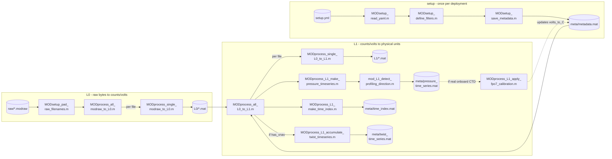
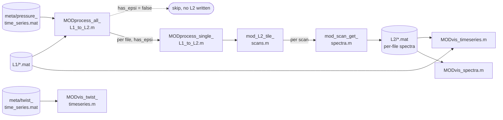
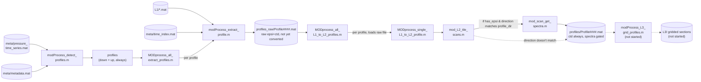
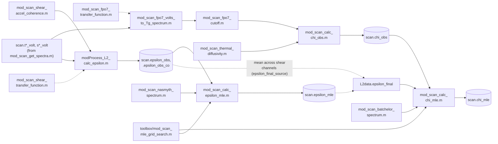

# Pipeline overview: realtime vs. postprocess

Every function this repo runs on an `epsi_mako`-class deployment, split by the two processing
modes (see `PLAN.md` Section 4, "Two processing modes"):

- **Realtime** - `modraw → L0 → L1 → L2` (per file). Runs on each raw file as it lands during a
  deployment - never waits for a complete profile, so it works even mid-cast. This is what the
  on-deployment/at-sea visualization tools consume.
- **Postprocess** - `modraw → L1 → profiles → grid`. Run once a deployment (or a leg of one) is
  done, against a complete L1 dataset - produces the final science-quality output.

L0 and L1 are shared, unmodified, by both modes - the fork happens entirely at the L2 step. Both
L2 paths share the same windowing core (`mod_L2_tile_scans.m`) but compute spectra independently;
that's a deliberate simplicity-over-storage-optimization call, not an oversight.

Diagrams below model an `epsi_mako`-class deployment - manifest details (2×FP07, 2×shear, 3×accel,
VecNav, onboard CTD, no ISAP/GPS) are taken from the one real `epsi_mako` `setup.yml` on disk
(`blt2021_0715`), not a claim that every deployment this repo processes looks exactly like this.

Click any diagram to expand it.

## Shared foundation: modraw → L0 → L1

Identical for realtime and postprocess. Setup is read once per deployment; L0 strips raw bytes to
counts with zero calibration; L1 applies every calibration this repo has (CTD, altimeter, twist)
and builds the deployment-level indexes (pressure record, file time index, twist timeseries) that
everything downstream depends on.

| Function | In → out | Role |
|---|---|---|
| `MODsetup_read_yaml.m` | setup_yml → metadata | Resolves AFE/CTD/altimeter manifest, calibration lookups, `has_epsi`/`has_vnav`/... flags |
| `MODsetup_define_filters.m` | metadata → metadata | Resolves each channel's fixed electronics/ADC transfer function once per deployment |
| `MODprocess_all_modraw_to_L0.m` | raw_dir, L0_dir → L0_files | Batch orchestrator; skips already-converted files |
| `MODprocess_single_modraw_to_L0.m` | modraw_file → L0_data | Parses one raw file: `$`-block regex match, header decode, counts/hex → per-type structs |
| `MODprocess_all_L0_to_L1.m` | L0_dir, metadata → L1_files | Batch orchestrator; also builds every meta/ index below |
| `MODprocess_single_L0_to_L1.m` | L0_data, metadata → data | Epsi counts→volts/g, CTD P/T/C/S, altimeter hab, `mod_L1_add_twist.m` |
| `MODprocess_L1_make_pressure_timeseries.m` + `mod_L1_detect_profiling_direction.m` | L1_dir → PressureTimeseries | Deployment-length pressure record + descending/ascending classification |
| `MODprocess_L1_make_time_index.m` | L1_dir → TimeIndex | Per-L1-file dnum start/end, so a profile's file(s) can be found without loading everything |
| `MODprocess_L1_accumulate_twist_timeseries.m` | L1_dir, meta_dir → TwistTimeseries | Re-chains per-file twist counts into one continuous deployment count - only if `has_vnav` |
| `MODprocess_L1_apply_fpo7_calibration.m` | L1_dir, metadata, PressureTimeseries → metadata | In-situ volts→°C fit against real CTD T - only if real onboard CTD |

## Realtime: L1 → L2 (per file), live viz

Runs on each L1 file as it lands - never waits for a complete profile. Skips cleanly if the
manifest has no AFE board (`has_epsi = false`). This is what the at-sea/live-monitoring apps
consume.

| Function | In → out | Role |
|---|---|---|
| `MODprocess_all_L1_to_L2.m` | L1_dir, metadata, L2_dir → L2_files | Batch orchestrator; no-ops if `!has_epsi` |
| `MODprocess_single_L1_to_L2.m` | data, metadata, PressureTimeseries → L2data | Thin wrapper around `mod_L2_tile_scans.m` |
| `mod_L2_tile_scans.m` | epsi, ctd, metadata, PressureTimeseries → L2data | 50%-overlap scan tiling, direction-gated (`is_down`), shared with postprocess |
| `mod_scan_get_spectra.m` | scan, metadata → scan.spectra | Raw pwelch per AFE channel - `acc`→`_g`, everything else→`_volt`, uncorrected |
| `MODvis_timeseries.m` | browses L0/L1/L2/Profile folder | Any dnum-carrying struct, up to 6 rows, dual y-axis |
| `MODvis_spectra.m` | browses L2 folder + sibling L1 | Click a point → that scan's raw spectrum, all channels |
| `MODvis_twist_timeseries.m` | TwistTimeseries → live axes | Cable-twist count for fin adjustment during the cast |

## Postprocess: L1 → profiles → grid

Run once against a complete L1 dataset. Every detected cast - both directions - gets a
`Profile####.mat` with its CTD record; `profile_dir` only gates whether that profile also gets
epsi spectra.

Runs as two explicit phases (extraction, then conversion), not one combined pass - see [Profile detection and extraction](profile_detection.md) for why.

| Function | In → out | Role |
|---|---|---|
| `modProcess_detect_profiles.m` | PressureTimeseries, metadata → profiles | Speed-limit hysteresis, min-length filter, same-direction merge. Always both directions |
| `modProcess_extract_profile.m` | profile, TimeIndex, metadata → profile_data | Stitches raw epsi/ctd across L1 file boundaries; real gap detection via `segment_id` |
| `MODprocess_all_extract_profiles.m` | metadata, profiles_raw_dir → profile_files | Batch orchestrator for extraction only, saves into `metadata.paths.profiles_raw` |
| `MODprocess_all_L1_to_L2_profiles.m` | metadata, profiles_dir, profiles_raw_dir → profile_files | Batch orchestrator for conversion: calls the extraction orchestrator, then loads+converts each raw file, saves into `metadata.paths.profiles` |
| `MODprocess_single_L1_to_L2_profile.m` | profile_data, metadata → L2data | No file I/O; CTD always attached; spectra computed only if `has_epsi && direction matches profile_dir` |
| `mod_L2_tile_scans.m` | epsi, ctd, metadata → L2data | Same core as realtime; `segment_id` skips any window spanning a real gap |
| `mod_scan_get_spectra.m` | scan, metadata → scan.spectra | Identical function, same as realtime path |
| `modProcess_L3_grid_profiles.m` | profiles → gridded sections | **Not started** - interpolate onto a standard pressure axis |

## Chi and epsilon - wired into `mod_L2_tile_scans.m`

The actual scientific payload of an `epsi_mako`-class deployment - both chi (FP07 thermal
dissipation) and epsilon (shear TKE dissipation) are now computed inside `mod_L2_tile_scans.m`
itself, called once per scan for every qualifying channel (gated on real onboard CTD T/S -
DeepSolo's P-only external CTD never qualifies for either). See [FP07 calibration and
chi](L2_calc_chi.md) and [Epsilon (shear turbulence)](L2_calc_eps.md) for the full writeups.

| Function | In → out | Role |
|---|---|---|
| `mod_scan_fpo7_volts_to_Tg_spectrum.m` | scan, metadata, channel → scan | Raw FP07 volts spectrum → tau-deconvolved temperature-gradient spectrum |
| `mod_scan_fpo7_transfer_function.m` | f, w, tau0, exponent → H | Thermal time-constant deconvolution filter, fall-speed dependent |
| `mod_scan_fpo7_cutoff.m` | scan, metadata, noise_coefs → scan | Noise-floor cutoff wavenumber (kc) for the integration range |
| `toolbox/seawater/ktemp.m` | SP, SR, T, P → ktemp | Thermal diffusivity via `gsw_rho`/`gsw_cp_t_exact` |
| `mod_scan_calc_chi_obs.m` | scan, metadata, channel, noise_coefs → scan | Direct-integration chi - needs real onboard CTD T |
| `toolbox/theoretical_spectra/batchelor_spectrum.m` | epsilon, chi, nu, ktemp, k → Psg | Theoretical Batchelor (1959) temperature-gradient spectrum |
| `mod_scan_calc_chi_mle.m` | scan, metadata, channel, noise_coefs → scan | Batchelor-spectrum MLE fit - now wired in, fed by epsilon below |
| `mod_scan_shear_transfer_function.m` | f, w, lc → H | Oakey (1982) shear-probe dynamic-response filter |
| `mod_scan_shear_volts_to_shear_spectrum.m` | scan, metadata, channel → scan | Raw shear volts spectrum → shear wavenumber spectrum |
| `mod_scan_shear_accel_coherence.m` | scan, metadata, channel → scan | Coherence vs. accelerometer channel a3, for spectrum cleaning |
| `mod_scan_calc_epsilon_obs.m` | scan, metadata → scan | Direct-integration epsilon (raw + coherence-cleaned), `eps1_mmp`/`epsilon2_correct` port |
| `toolbox/theoretical_spectra/nasmyth_spectrum.m` | epsilon, nu, k → Psg | Theoretical Nasmyth shear spectrum |
| `mod_scan_calc_epsilon_mle.m` | scan, metadata → scan | Nasmyth-spectrum MLE fit epsilon |
| `mod_scan_calc_fom.m` | k, Pobs, Pmodel, klim, dof → fom | Generic figure of merit, used by epsilon (chi's own FOM still not built) |
| `modProcess_L2_calc_epsilon.m` | scan, metadata, channel → scan | Per-channel epsilon orchestrator, called once per shear channel per scan |
| `processing/scans/mod_scan_mle_grid_search.m` | Pobs, dof, model_fn, seed, ... → best_val | Generic MLE grid search, shared by chi_mle and epsilon_mle |
